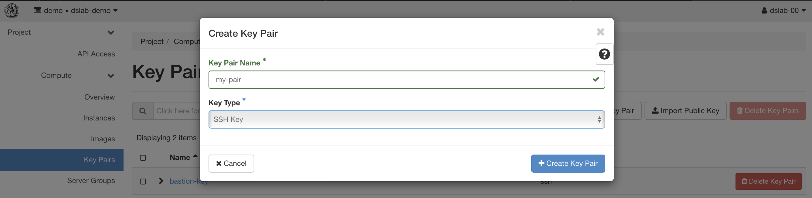
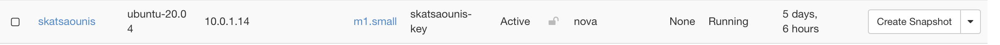

# 2 - Virtual Machine setup

- Create an SSH key to be used for accessing the Virtual Machine: <https://console.cloud.ntua.gr/project/key_pairs>
  
- Launch a Virtual Machine:
  - Source image name: `Ubuntu 22.04`
  - Flavor: `m1.small`
  - Network: `dslab-demo`
  - Security Groups: `default`
  - Key Pair: `my-ssh-key`
  - All other options set to default

## Validation

VM is put in `Running` state.

