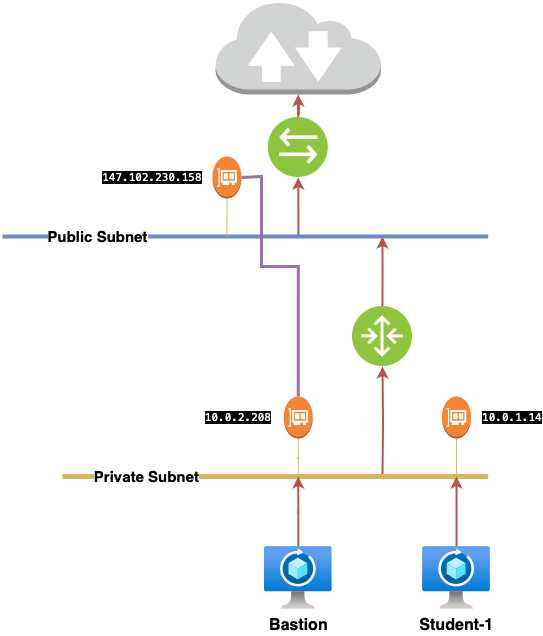

# 3 - Networking



## Setup SSH

Assuming `skatsaounis-vm` as VM name:

```bash
cp config/bastion-key.pem ~/.ssh/
chmod 600 ~/.ssh/bastion-key.pem
cat config/ssh-config >> ~/.ssh/config
chmod 600 ~/.ssh/config

ssh skatsaounis-vm
```
